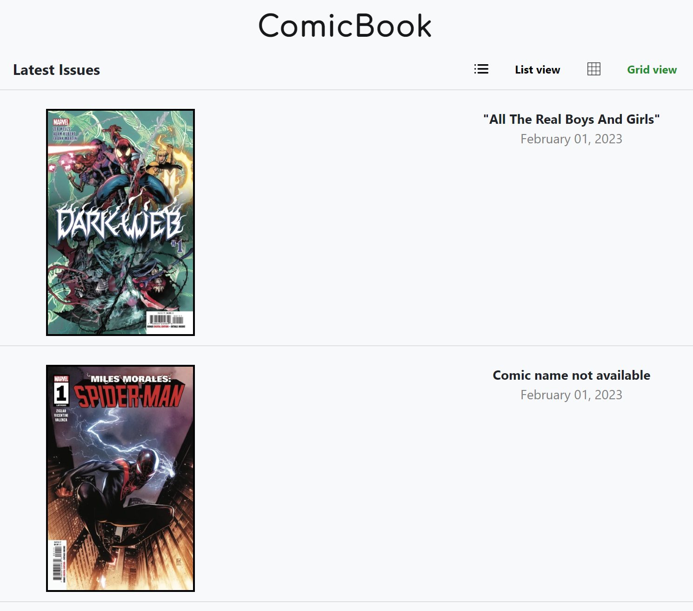
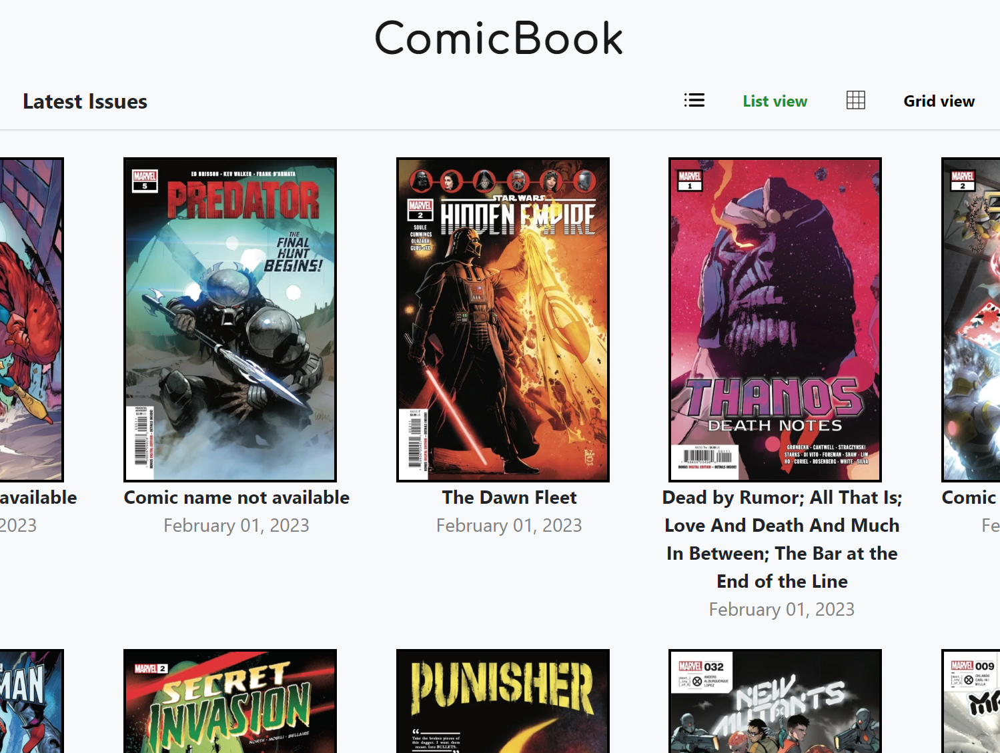
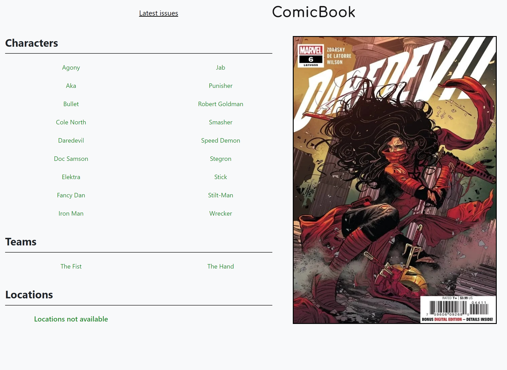

# Comic Vine API examen

# Requiere Python3 y Flask

## Instalacion

**pip install -r requirements.txt** en Windows 

**pip3 install -r requirements.txt** en Linux o Mac

Luego corremos el servidor con **flask run** y abrimos el sitio en **localhost:5000**

## LIST VIEW

## GRID VIEW

## Issue Detail

